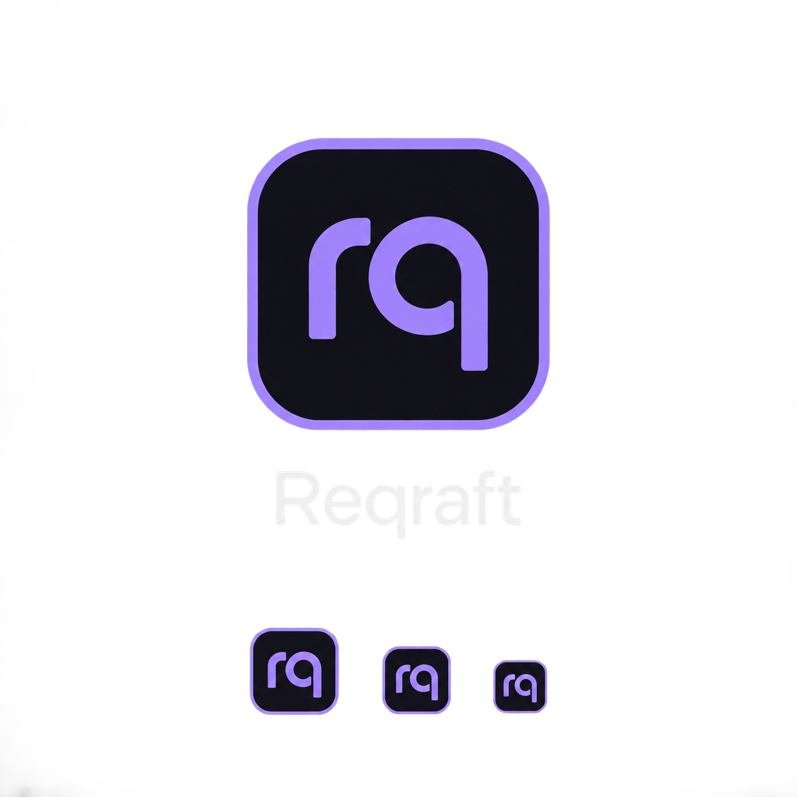

# Reqraft — desktop identity

The shipped mark reuses the landing page's lowercase `rq`, JetBrains Mono
Medium, lavender `#a78bfa`, translucent violet fill and rounded badge.

- Source: `src/apps/desktop/renderer/assets/brand/reqraft-mark.svg`.
- The two glyphs are outlined from JetBrains Mono Medium (upstream
  `JetBrains/JetBrainsMono`, `fonts/ttf/JetBrainsMono-Medium.ttf`), retaining the
  font's 600-unit advance. The accompanying OFL covers the source font.
- `BrandMark` loads this local SVG in the desktop renderer. No remote font or
  service is required at runtime.
- `build/icon.png` adapts the same badge to a dark rounded application tile.
  Regenerate it with `node --import tsx scripts/generate-icon.ts` in a graphical
  session with the project's Electron installed. Electron-builder consumes
  this 1024×1024 PNG for desktop packages. Regeneration does not install the app.
- The tray retains its existing three status indicators (idle, busy, error).

## Alternative proposal — not shipped

This generated concept explores a heavier, geometric `rq` and a square outline
for better recognition at small sizes. It is a design proposal, not a final
vector master. If selected, redraw and optically validate it at 16, 32, 64 and
1024 pixels before replacing the existing identity.
